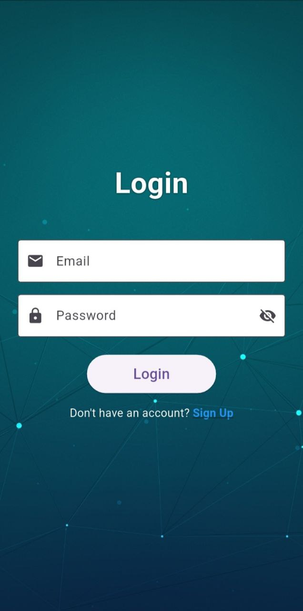
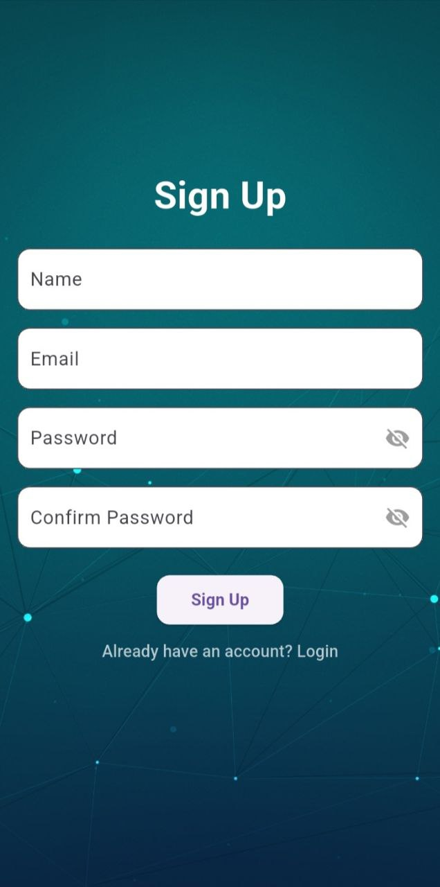
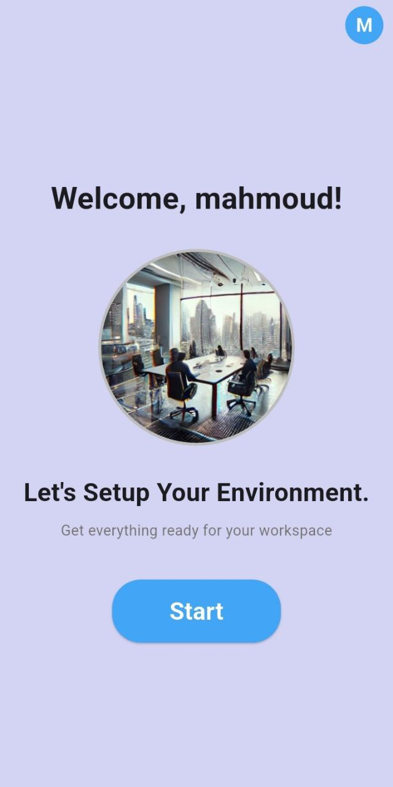
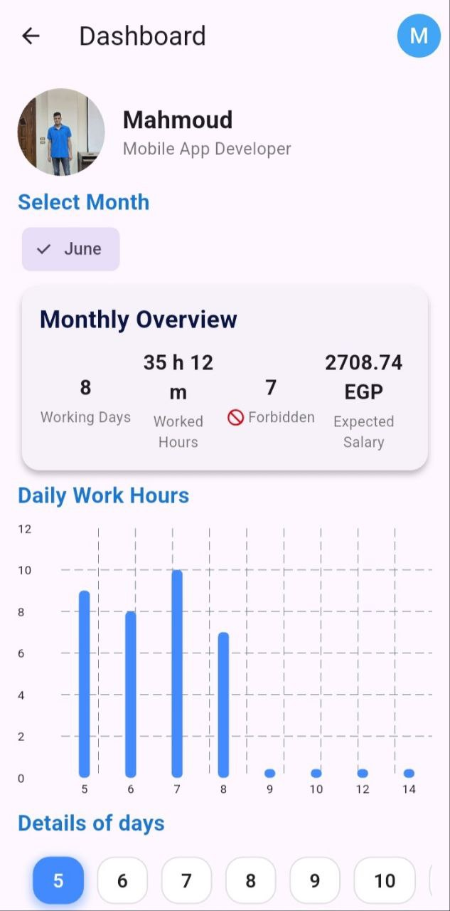
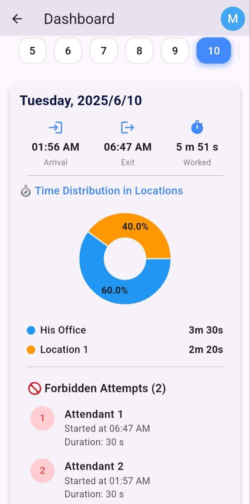
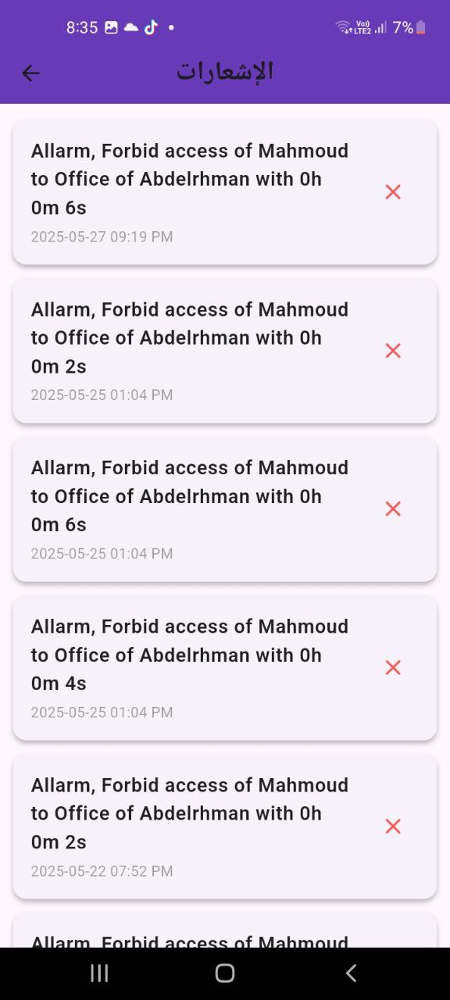
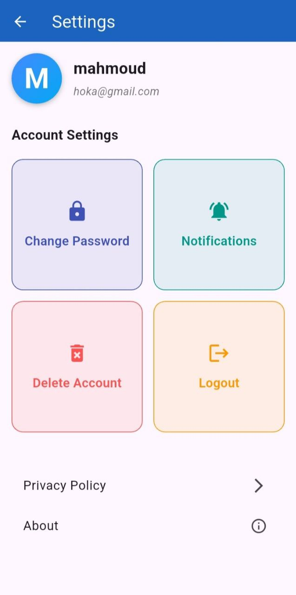

<div align="center">
  

  # 🚀 👁️‍🗨️ ShiftWatch

  **AI-powered Workplace Monitoring & Employee Tracking System**

  [](https://flutter.dev/)
  [](https://firebase.google.com/)
  [](https://dart.dev/)
</div>

---

## 📖 Table of Contents
- [📌 Overview & Project Idea](#-overview--project-idea)
- [🚀 Key Features](#-key-features)
- [🎥 Video Demonstrations](#-video-demonstrations)
- [📱 App Previews](#-app-previews)
- [🧱 Tech Stack & Architecture](#-tech-stack--architecture)
- [🚀 Getting Started](#-getting-started)
- [📁 Project Structure](#-project-structure)

---

## 📌 Overview & Project Idea

**ShiftWatch** is an intelligent Flutter application designed to help organizations monitor employee activity, manage shifts, and analyze workplace behavior using **AI-powered video processing**. Built with a focus on performance, clean architecture, and responsive design, this application provides an intuitive experience for both administrators and employees.

The supervisor uploads a workplace surveillance video, and the system automatically:
- 📅 **Detects employee attendance times**
- 🚶 **Tracks movement inside designated work zones**
- ⏱ **Calculates actual working hours**
- 📊 **Generates analytics and performance insights**

---

## 🚀 Key Features

- 🔐 **Firebase Authentication:** Secure login & registration.
- 🎥 **AI-based Video Analysis:** Transform surveillance into actionable insights.
- 📍 **Polygon-based Work Zone Mapping:** Manage designated work locations and verify check-ins.
- 👨‍🏭 **Employee Management System:** Effortlessly add, update, and manage profiles.
- 📊 **Real-time Analytics Dashboard:** Interactive data visualization.
- ☁️ **Firebase + Azure Cloud Integration:** Robust backend data synchronization.
- 🛎 **Firebase Cloud Messaging (FCM):** Real-Time Push Notifications.
- 🌍 **Multi-language Support:** (EN / AR).
- 📶 **Offline Support:** Handles network state changes gracefully.

---

## 🎥 Video Demonstrations

See ShiftWatch in action! 

### Onboarding Module Video
<div align="center">
  <video src="https://raw.githubusercontent.com/M-AboGamihe/shiftwatch/main/videos/onboarding.mp4" controls="controls" muted="muted" width="600">
    Your browser does not support the video tag.
  </video>
</div>

### Main App Flow Video
<div align="center">
  <video src="videos/main_flow.mp4" controls="controls" muted="muted" width="800">
    Your browser does not support the video tag.
  </video>
</div>

---

## 📱 App Previews

Explore the clean and intuitive user interfaces of ShiftWatch.

### Authentication & Setup
| Login | Sign Up | Setup Overview |
| :---: | :---: | :---: |
|  |  |  |

### Location Management (Work Zone Drawing)
| Choose Location Options | Set Number of Locations | Determine Exact Locations |
| :---: | :---: | :---: |
|  |  |  |

### Core Functionality
| Home Screen | Side Menu | Data Entry |
| :---: | :---: | :---: |
|  |  |  |

### Employee Management
| Employee Profile | Edit Profile | Dashboard Overview |
| :---: | :---: | :---: |
|  |  |  |

### Analytics & Settings
| Dashboard Details | Notifications | General Settings |
| :---: | :---: | :---: |
|  |  |  |

### Security
| Password Settings |
| :---: |
|  |

---

## 🧱 Tech Stack & Architecture

This project is fully refactored using modern Flutter architecture:

### **Frontend**
- **Framework:** Flutter (SDK >=3.5.4)
- **Architecture:** Clean Architecture + Feature-based structure
- **State Management:** **BLoC** (Business Logic Component) & **Provider** for scalable, predictable state handling.
- **UI & Visualization:** Custom components, `fl_chart`, `syncfusion_flutter_charts`.

### **Backend & Cloud**
- **Authentication:** Firebase Auth
- **Database:** Cloud Firestore & Firebase Realtime Database
- **Storage:** Firebase Cloud Storage
- **Cloud Infrastructure:** Azure Cloud Integration
- **Messaging:** Firebase Cloud Messaging (FCM)

### **Core Libraries**
- `dartz` & `equatable`: Functional programming & error handling.
- `connectivity_plus`: Network monitoring.
- `permission_handler`: Robust device permission management.

---

## 🚀 Getting Started

Follow these instructions to get a local copy up and running.

### Prerequisites

- [Flutter SDK](https://docs.flutter.dev/get-started/install)
- A configured Firebase Project.

### Installation

1. **Clone the repository:**
   ```bash
   git clone https://github.com/M-AboGamihe/shiftwatch.git
   cd shiftwatch
   ```

2. **Install dependencies:**
   ```bash
   flutter pub get
   ```

3. **Configure Firebase:**
   - Download the `google-services.json` file and place it in the `android/app/` directory.
   - Download the `GoogleService-Info.plist` file and place it in the `ios/Runner/` directory.

4. **Run the application:**
   ```bash
   flutter run
   ```

---

## 📁 Project Structure

```text
lib/
├── core/             # Core configurations, services, DI (service_locator)
├── features/         # Feature-specific logic (auth, dashboard, employees, tracking, notifications)
├── models/           # Data models and entities
├── screens/          # Primary UI screens
├── user_panel/       # User-specific settings and profile screens
└── widgets/          # Reusable, custom UI components
```

---
<p align="center"><i>If you like this project, please consider giving it a ⭐!</i></p>
